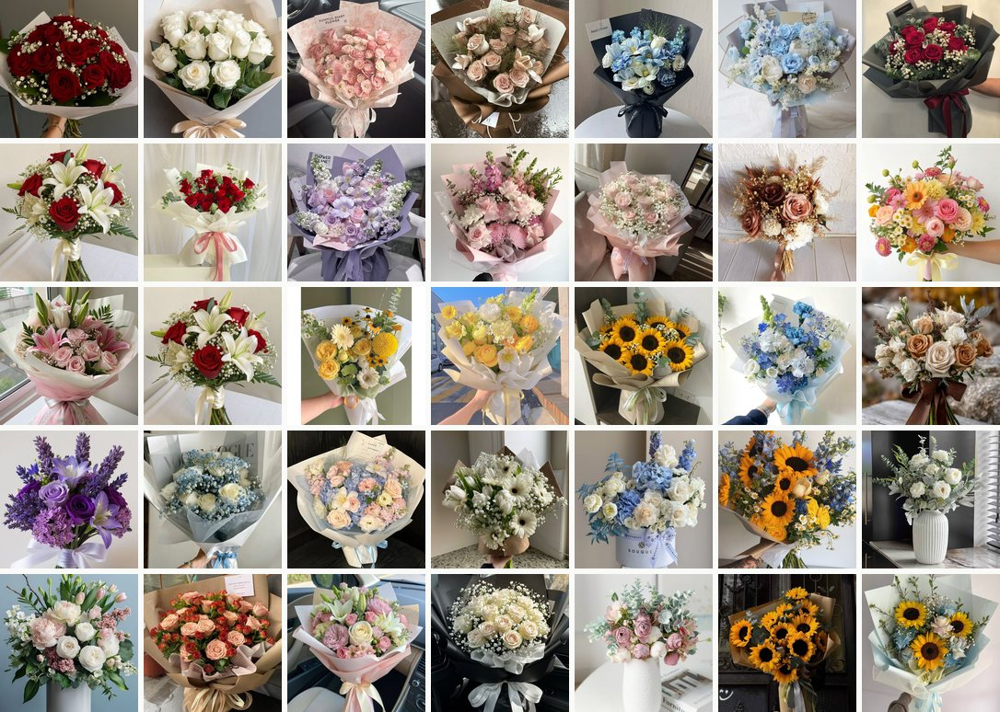
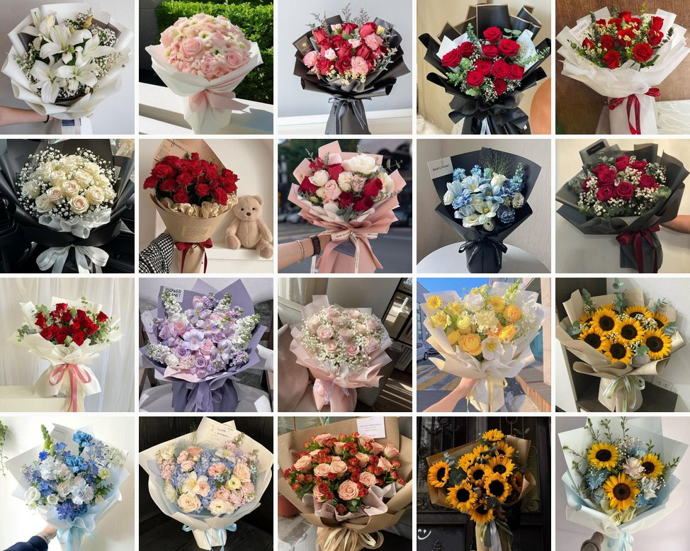
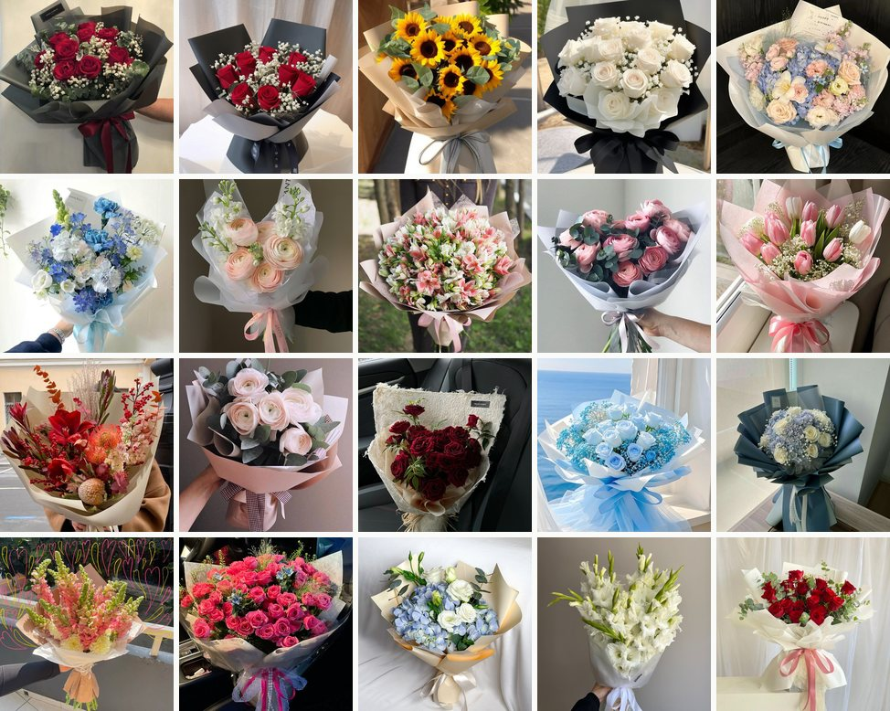
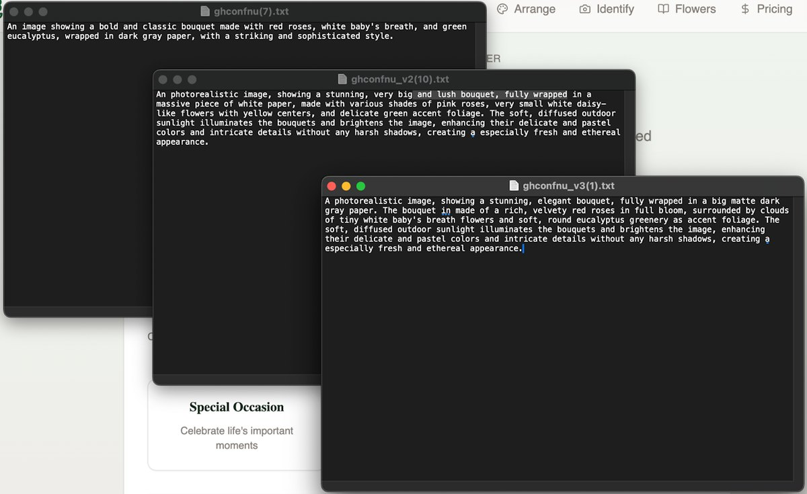

# BloomCraft

An AI design engine for floral arrangements. Describe the occasion, the recipient, the
style and the budget; get back a costed bouquet built from a real flower catalogue, with
the meanings and care instructions attached.


Two things drive the project: closing the gap between what a customer pictures and what a
florist builds, and making arrangements **culturally aware**, so a bouquet says what you
meant it to say wherever it's sent.

## Why

I once tried to buy a bouquet for a teacher I hadn't seen in years. I had a clear picture
in my head and no vocabulary for it. The florist had no way to turn my vague gestures into
an arrangement. It took far longer than planned, the price landed well over what I had in
mind, and I was late to the meeting.

That failure has three separable parts, and each is something software can help with:

| Problem | What BloomCraft does about it |
| --- | --- |
| You can't describe what you want | A structured brief — occasion, recipient, style, budget — replaces free-form description |
| You don't know the cost until it's built | Every flower carries a price range, so the total is computed before anything is cut |
| You can't see it until it exists | A fine-tuned diffusion model renders the arrangement |

And a fourth, which is the one I care most about. Having lived in both Asia and Europe,
I've watched the same flower carry opposite meanings across a border. White chrysanthemums
are a funeral flower across much of East Asia and an ordinary cheerful bloom in much of
Europe. A bouquet that reads as warm in one country can read as a condolence in another.
Flower choice is a language, and nobody hands you the dictionary.

## What's here

The repository holds the web application. The image model is trained and run separately —
see [Image generation](#image-generation-stable-diffusion-21--dreambooth) for why the
weights aren't committed.

| | What it does | Where |
| --- | --- | --- |
| Web app | Bouquet recommendation, flower library, image recognition, accounts, billing | this repo |
| ghconfnu | Fine-tuned SD 2.1 checkpoint for bouquet imagery | `Assets/` (untracked) |

---

## The web app

### The brief

`MultiStepBouquetGenerator.tsx` walks through four steps:

1. **Primary purpose** — gift, special occasion, decoration.
2. **A secondary question that branches on the first** — *which* occasion, or *who* the
   gift is for. The branch matters: "who is this for" and "what are we celebrating" are
   different questions, and collapsing them into one generic field produces a vaguer brief.
3. **Style and budget.**
4. **Free-text notes**, for anything the structure didn't capture.

### The prompt

This is the core of the system, and it has to do three things: take the brief in, design an
arrangement against its constraints, and return that design in a shape the UI can render
without parsing prose.

```
You are a florist assistant AI. Based on the user's preferences, respond with a
**valid JSON object** that matches this exact structure and includes no text outside
of the JSON:

{
  "flowers": [
    {
      "flower": {
        "id": string,
        "name": string,
        "scientificName": string,
        "meaning": string,
        "regions": string[],
        "careInstructions": string,
        "priceRange": { "min": number, "max": number }
      },
      "quantity": number
    }
  ],
  "totalPrice": number,
  "style": string,
  "occasion": string,
  "description": string,
  "primaryPurpose": string,
  "secondaryChoice": string
}

INSTRUCTIONS:
- Generate a bouquet consisting of multiple types of flowers (not just one).
- Carefully select a harmonious combination of flowers that suits the user's specified
  primary purpose, secondary choice, style, and budget.
- Assign realistic quantities to each flower type so that the total price fits within
  the user's budget.
- Ensure the bouquet composition reflects appropriate symbolism and seasonal
  availability if relevant.
- Provide meaningful care instructions and flower details for each flower.
- Fill all fields with accurate and coherent information.
- Return ONLY a compact/minified JSON (no line breaks, no markdown code fences, no
  extra explanation).
- The key "flowers" must hold an array of **multiple distinct flower objects**,
  representing a bouquet with varied flower types selected thoughtfully for the
  user's preferences.

USER INPUT:
- Primary Purpose: ${primaryPurpose}
- Secondary Choice: ${secondaryChoice}
- Style: ${selectedStyle}
- Budget: ${selectedBudget}
- Notes: ${additionalNotes || "None"}
```

Three decisions in there are load-bearing:

- **`quantity` sits outside the flower object.** The model picks species and *how many of
  each*, which is what lets the budget constraint actually bind — it can reach a price
  point by adjusting counts rather than by swapping to cheaper flowers.
- **`meaning` and `regions` are required per flower.** These are the cultural hooks. Asking
  for them forces the model to commit to a reading of each choice rather than picking on
  looks alone.
- **"Multiple distinct flower objects"** is stated twice, at the top and bottom of the
  instructions. Without it the model reliably returns a monoculture — twelve roses — which
  is not an arrangement.

The prompt goes to the Express proxy, which calls DeepSeek through OpenRouter
(`deepseek/deepseek-chat-v3-0324`). Models wrap JSON in markdown fences regardless of being
told not to, so `safeJsonParse()` in `server/index.ts` strips them before parsing and
returns `null` instead of throwing. The route then answers with a usable message rather
than a stack trace — a model failing to follow a format is an expected condition, not an
exception.

A step this prompt does **not** yet do is construct the image-generation prompt. That was
deliberately deferred until the diffusion model was trained far enough to know what prompt
format it responds to best.

### Flower library

`src/data/flowers.ts` defines the `Flower` shape:

```ts
interface Flower {
  id, name, scientificName
  colors[], occasion[], season[], regions[]
  meaning, symbolism, description
  priceRange: { min, max }
  careInstructions
}
```

This is what keeps the recommendations concrete. The model selects from a known catalogue
with real prices attached, so the total is arithmetic over the returned quantities rather
than a number it invented.

### Image recognition

`FlowerRecognition.tsx` runs `google/vit-base-patch16-224` **in the browser** via
`@huggingface/transformers` on the WebGPU backend. Nothing is uploaded — the image is drawn
to a canvas and classified locally, from the camera or a file. The top five labels are then
matched against the flower database in both directions (label contains name, name contains
label), so a coarse hit like "daisy" still resolves to a catalogue entry.

### Accounts, credits, billing

Supabase provides auth and Postgres. A generation costs one credit, deducted through a
`deduct_credits` RPC so the decrement happens atomically server-side rather than as a
read-modify-write from the client. Subscribers skip the credit check entirely.

Stripe runs through four Supabase edge functions — `create-checkout`, `check-subscription`,
`customer-portal`, `delete-account`. Row-level security is on for every table; policies
live in `supabase/migrations/`.

---

## Image generation: Stable Diffusion 2.1 + DreamBooth

**ghconfnu** is Stable Diffusion 2.1 fine-tuned with
[TheLastBen's fast-dreambooth](https://github.com/TheLastBen) on hand-captioned bouquet
photography, run locally through AUTOMATIC1111 at 512×512. It went through four training
rounds, each aimed at a specific weakness of the one before.

Every round is a directory of paired `image.jpg` / `image.txt` files under `Assets/`.

### V1 — the base model



35 images, the largest set, chosen for **consistent framing**: the bouquet sits in roughly
the same place in the frame every time. That consistency is deliberate. A diffusion model
learns whatever is constant across the set, so holding the composition fixed spends its
capacity on the flowers rather than on the photography.

At this stage I was selecting for a wide range of colours and paying little attention to
which *species* were appearing.


The V1 sampling settings are in `Assets/ghconfnu_v1_results/Pink_bouquet_prompt.txt`:

```
CFG scale: 3
Steps: 59
Negative: vase, human body, human, arm, hand, uncentered bouquet, dark image,
          paintings, people, person, cars, house, suits, head, glasses,
          watermarks, logos, text, not a bouquet
```

The low CFG is deliberate. The captions are long and specific, so the model needs latitude
to compose rather than being clamped hard to every clause. Most of the negative prompt
exists to remove artefacts of the source photography — florist photos are full of hands
holding the bouquet, shop watermarks, and people in frame.

### V2 — filling in the colours the model was bad at



V1 turned out to be excellent at pink and white bouquets and noticeably weaker everywhere
else — unsurprising, since those dominate florist photography, and therefore dominated the
set. V2 was assembled to correct that, weighted toward:

- red bouquets
- sunflower-based yellow bouquets
- rarer colours — blue and purple

This round also brought lighting under deliberate control rather than accepting whatever
the source photo had. `Assets/ghconfnu_v2_training_data/Flowers_that_appeared.txt` is the
running inventory of species and colourways covered — roses, lilies, tulips, carnations,
snapdragons, alstroemeria, campanula, hydrangea, ranunculus, delphinium, sunflowers.


| | Subject | Steps | Seed | Time |
| --- | --- | --- | --- | --- |
| Top left | Pink roses, baby's breath, white paper | 59 | 1312751474 | 22.4 s |
| Top right | Blue hydrangea, cream roses, white lilies, pink snapdragons | 120 | 233489203 | 23.7 s |
| Bottom left | Sunflowers, eucalyptus, brown kraft paper | 59 | 4284124167 | 19.9 s |
| Bottom right | Cream roses, baby's breath, matte black paper | 59 | 12598560 | 11.8 s |

All at CFG 3, Euler a, 512×512, model hash `5d89f2c71e`.

The negative prompt also grew between rounds. V2 adds **pot, box, skin, weirdly shaped
bouquet, incomplete bouquet** and later **disproportional bouquet** — each one a failure
mode observed in V1 output rather than a guess. "Skin" is there because hands kept
surviving "hand"; the shape terms are there because a model good at petals is not
automatically good at the silhouette of a whole arrangement.

By the end of V2 the model was producing consistently usable bouquets: far fewer distorted
arrangements, and the flowers themselves were simply nicer to look at.

### V3 and V3.5 — targeted repair




With general quality settled, V3 and V3.5 stopped trying to be representative. The strategy
became: pick images that are **strongly characteristic** of a specific weak case — a
definitively red bouquet, say — and push them through more training cycles than the rest.
Concentrating repetition on a narrow target moves the model on that target substantially,
at the cost of generality. V3.5 is a 10-image refinement pass in the same spirit.

| Round | Pairs | Aim |
| --- | --- | --- |
| `ghconfnu_v1_training_data` | 35 | Base. Consistent framing, broad colour coverage |
| `ghconfnu_v2_training_data` | 20 | Reds, yellows, blues and purples; deliberate lighting |
| `ghconfnu_v3_training_data` | 20 | Characteristic images, more cycles, longer captions |
| `ghconfnu_v3.5_training_data` | 10 | Further targeted refinement |

### Caption strategy

Captions are read alongside the image during training, so they teach two things at once:
what the thing in the picture is called, and what phrasing to expect at inference.

The strategy that worked was to **write the caption in exactly the format I would later
type as a prompt**. If the same sentence structure arrives at generation time, the model has
seen it before and can associate it with an image it was trained on. Prompt and caption stop
being two dialects of the same request.

One image makes the progression visible. It's strongly representative of a red bouquet, so
it appears in every round — as `ghconfnu(7)`, `ghconfnu_v2(10)`, `ghconfnu_v3(1)` and
`ghconfnu_v3.5(1)`:




**V1** reads like a label written after the fact:

> An image showing a bold and classic bouquet made with red roses, white baby's breath, and
> green eucalyptus, wrapped in dark gray paper, with a striking and sophisticated style.

**V2** adopts the prompt format wholesale — the long photorealistic-image construction, with
lighting described.

**V3** keeps that format and adds detail, separating subject, wrapping, filler, foliage and
lighting into clauses that can each be pulled on independently at inference:

> A photorealistic image, showing a stunning, elegant bouquet, fully wrapped in a big matte
> dark gray paper. The bouquet [is] made of a rich, velvety red roses in full bloom,
> surrounded by clouds of tiny white baby's breath flowers and soft, round eucalyptus
> greenery as accent foliage. The soft, diffused outdoor sunlight illuminates the bouquets
> and brightens the image […] without any harsh shadows.

The added detail is not padding — each new clause is a control surface. "Matte dark gray
paper" and "soft, diffused outdoor sunlight" became things I could vary at generation time
precisely because they were named at training time.

### Why the weights aren't here

`Assets/` is gitignored. `ghconfnu.ckpt` alone is 2.6 GB, past GitHub's file size limit, and
the training sets are photographs collected as reference rather than material I can
relicense. Everything in `docs/images/` is a downscaled derivative kept for documentation.

---

## Roadmap

Built and working:

- Multi-step brief → structured recommendation with per-flower pricing
- Flower library with meanings, symbolism, care and regions
- In-browser flower recognition
- Accounts, credits, subscriptions
- ghconfnu image model, trained through V3.5

Planned:

- **Wire ghconfnu into the app.** Today it runs offline and produces reference imagery. The
  goal is generation per arrangement, with backgrounds the user picks — a wedding table, a
  teacher's desk, a living room — which also means adding the deferred prompt-construction
  step to the DeepSeek call.
- **Cultural intelligence in the recommendation.** A destination field, and region-aware
  checking of what an arrangement's flowers mean where it's being sent.
- **Bouquet editing.** Swap a flower, change the fullness, adjust colours, and see price and
  image update.
- **Start from anywhere.** Enter by occasion, by a favourite flower, or by uploading an
  inspiration image.
- **Education hub.** Flower cards and guides for weddings, condolences, thank-yous, and what
  a finished arrangement "says".
- **Save and share** an arrangement — with a friend, or with a local florist to build.
- **Feedback loop.** Users rate bouquets; ratings inform later suggestions.

---

## Stack

| Layer | Choice |
| --- | --- |
| Frontend | React 18, TypeScript, Vite, Tailwind, shadcn/ui, React Router, TanStack Query |
| Backend-as-a-service | Supabase — Postgres, auth, RLS, edge functions |
| Proxy | Express (TypeScript), keeps the OpenRouter key server-side |
| Text model | DeepSeek Chat v3 via OpenRouter |
| Vision model | ViT base patch16-224, in-browser via transformers.js + WebGPU |
| Payments | Stripe |
| Image model | Stable Diffusion 2.1, DreamBooth fine-tune (fast-dreambooth), AUTOMATIC1111 |

The frontend was scaffolded with [Lovable](https://lovable.dev). The backend API, the
prompt-engineering pipeline and the image-model training are hand-built.

## Running locally

Requires Node.js and a Supabase project.

```bash
npm install
npm run dev            # Vite dev server
```

The recommendation endpoint needs the proxy running alongside it:

```bash
cd server
npm install
echo "OPENROUTER_API_KEY=sk-or-..." > .env
npm run dev            # listens on :3001
```

Supabase credentials are read from `src/integrations/supabase/client.ts`. Apply the schema
with the migrations in `supabase/migrations/`.

The server refuses a request without `OPENROUTER_API_KEY` and returns an explicit
"backend misconfigured" error rather than failing opaquely at the API call.

## Layout

```
src/
├── components/
│   ├── MultiStepBouquetGenerator.tsx   # four-step brief → DeepSeek → costed bouquet
│   ├── FlowerRecognition.tsx           # in-browser ViT classification
│   ├── FlowerLibrary.tsx  HeroSection.tsx  Navigation.tsx  CreditsDisplay.tsx
│   └── ui/                             # shadcn/ui primitives
├── hooks/
│   └── useAuth.tsx  useCredits.tsx  useSubscription.tsx  useFlowers.tsx
├── data/flowers.ts                     # flower catalogue + occasion/style/budget options
├── integrations/supabase/              # client + generated types
└── pages/                              # Index, Auth, Profile, Pricing, FlowerLibrary, legal
server/index.ts                         # Express → OpenRouter proxy
supabase/
├── functions/                          # create-checkout, check-subscription,
│                                       # customer-portal, delete-account
└── migrations/                         # schema, RLS policies, deduct_credits RPC
docs/images/                            # training contact sheets + sample output
Assets/                                 # training data + checkpoint (untracked)
├── ghconfnu.ckpt                       # 2.6 GB
├── ghconfnu_v{1,2,3,3.5}_training_data/
├── ghconfnu_v1_results/
└── flower_embeddings_dataset/
```

## Known gaps

- **ghconfnu is not wired into the app.** Imagery is generated offline and used as
  reference, not served per request. This is the largest gap between the idea and the build.
- **Cultural awareness has no destination.** The prompt asks for `meaning` and `regions` per
  flower and for symbolism to be respected, but the brief never asks where the bouquet is
  going, so there is nothing to check the arrangement against.
- **The date in the prompt is hard-coded** — `Current date: Wednesday, July 23, 2025`. Any
  seasonality reasoning is frozen to that day.
- **The proxy URL is hard-coded** to `http://localhost:3001`, so the deployed frontend
  cannot reach it.
- **The V2 caption for `ghconfnu_v2(10)` is wrong.** It's byte-identical to the pink bouquet
  prompt in `ghconfnu_v1_results/`, while the image is the red-rose bouquet in dark gray
  paper — the prompt format was adopted, but the wrong prompt got pasted. Worth fixing
  before any retrain including the V2 set.
- **Recognition is limited by ViT's ImageNet labels**, which are coarse for flowers. The
  two-way fuzzy match to the catalogue hides this rather than solving it; a classifier
  fine-tuned on the catalogue's own species would be the real fix.
- `(Unused)BouquetGenerator.tsx` is the superseded single-step generator, kept for
  reference.
